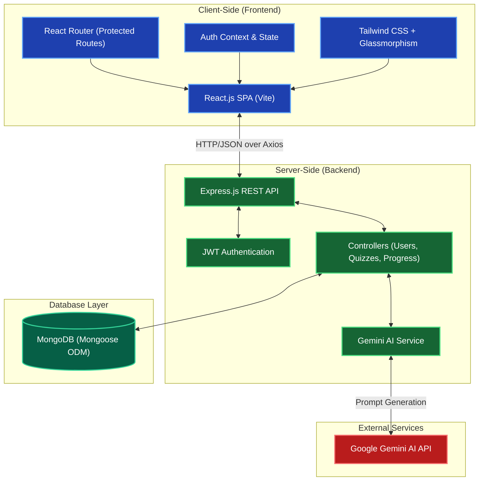

# System Architecture: FinLearn (FIN-08)

The Financial Literacy Learning App is built using the **MERN Stack** (MongoDB, Express, React, Node.js) combined with modern frontend build tools (Vite) and external AI integrations (Google Gemini).

## High-Level Architecture Diagram

## Component Breakdown

### 1. Client-Side (Frontend)
- **Framework:** React.js powered by Vite for lightning-fast HMR and optimized production builds.
- **Styling:** Custom CSS with Dribbble-inspired dark mode, glassmorphism, and neon gradients for a highly premium, gamified feel.
- **Routing:** `react-router-dom` handles navigation, utilizing a `ProtectedRoute` wrapper to securely wall off the Dashboard and courses from unauthenticated users.
- **State Management:** React Context API (`AuthContext`) is used to globally manage the user's session, JWT token, and XP/Rank.
- **Icons:** `lucide-react` (mocked in our custom implementation for stability) for beautiful, scalable SVG iconography.

### 2. Server-Side (Backend)
- **Environment:** Node.js runtime.
- **Framework:** Express.js RESTful API handling routing, middleware, and request/response lifecycles.
- **Authentication:** JSON Web Tokens (JWT) for stateless authentication, with `bcryptjs` for secure password hashing.
- **AI Integration Module:** A dedicated service layer (`geminiService`) interfaces with the Google Generative AI SDK to automatically generate quiz questions based on lesson content.

### 3. Database Layer
- **Database:** MongoDB (NoSQL) for flexible schema design, ideal for hierarchical learning content and dynamic user progress.
- **ODM:** Mongoose is used to enforce schemas, validate data (e.g., ensuring emails are unique), and manage relationships (e.g., linking a `QuizAttempt` to a `User` and a `Lesson`).

### 4. Data Flow Example: Taking a Quiz
1. The **React UI** requests the quiz data from the **Express API**.
2. The **Express API** queries **MongoDB** to retrieve the questions and sends them back.
3. The user selects answers in the **React UI** and clicks Submit.
4. The **React UI** sends a POST request with the answers to the **Express API**.
5. The **Express API** controller calculates the score, updates the user's XP and checks for new Badges in **MongoDB**, then returns the result.
6. The **React UI** displays a celebratory gamification screen based on the returned score.
